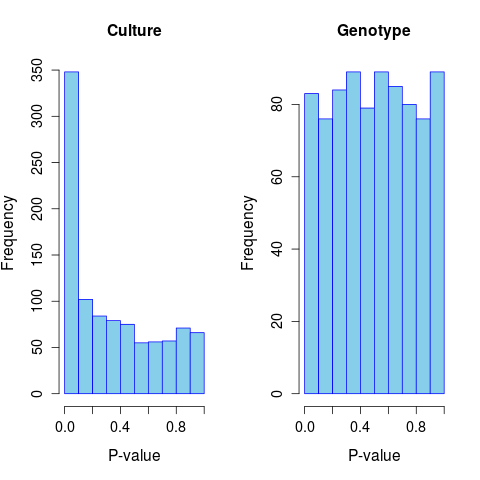
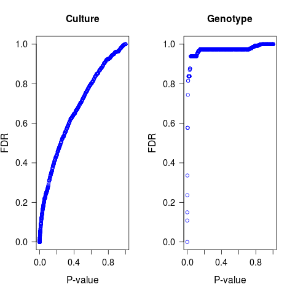
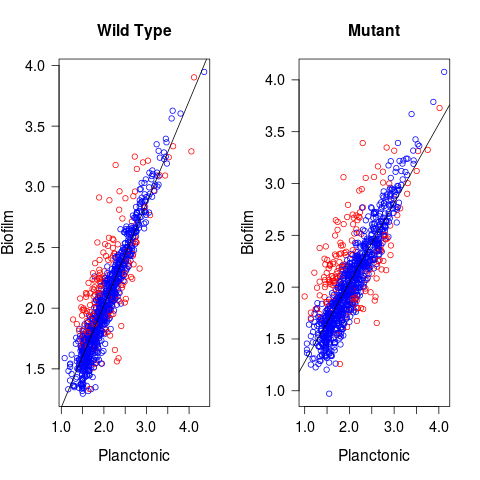
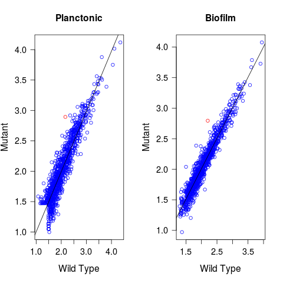

## Introducción 

La expresión génica es el proceso mediante el cual, la información de un gen se emplea para la síntesis de un producto, sean proteínas, tRNA o snRNA.
La expresión diferencial de un gen se refiere a las diferencia estadísticamente significativa en los niveles de expresión de un gen en respuesta  a dos o más condiciones distintas (variables). 
Como herramientas para el análisis de estas expresiones diferenciales se emplean 
métodos estadísticos que permiten cuantificar los cambios en los niveles de expresión entre diferentes grupos. 
 
## Materiales y Métodos 
Se emplearon cuatro librerías que corresponden a la arqueobacteria Sulfolobus acidocaldarius, a los organismos se les introdujo o no una mutación y/o se encuentran cultivados en un medio platónico o de biopelícula.

Organismo Wild Type en medio platónico, el cual se denominará “WildType_P”.

Wild Type cultivado en biopelícula, denominado “Wildtype_B”.

Organismo mutado en medio platónico, se denominará Mutant_P.

Organismo mutado y cultivado en biopelícula, denominado Mutan


### Prueba de Expresión Diferencial

Procesamiento de las librerías en R.

```{r setup, include=FALSE}
###Se definió el directorio con los archivos de entrada y aquellos donde se almacenarán los resultados.
input_dir  <- file.path("..","count")
output_pseudo <- file.path("..","diff_expr", "pseudocounts") 
output_histogram <- file.path("..","diff_expr", "histograms") 
output_pvalue_fdr <- file.path("..","diff_expr", "pvalue_fdr") 
output_table <- file.path("..","diff_expr", "tables")
###prueba
if(!file.exists(input_dir)){
  stop("Data directory doesn't exist: ", input_dir)
}
if(!file.exists(output_pseudo)){
  dir.create(output_pseudo, mode = "0755", recursive=T)
}
if(!file.exists(output_histogram)){
  dir.create(output_histogram, mode = "0755", recursive=T)
}
if(!file.exists(output_pvalue_fdr)){
  dir.create(output_pvalue_fdr, mode = "0755", recursive=T)
}
if(!file.exists(output_table)){
  dir.create(output_table, mode = "0755", recursive=T)
}
```


```{r, include=FALSE}
library(edgeR)
```

Se llamó a los archivos de entrada y se nombranon las columnas 

```{r}
wild_p <- read.delim(file=file.path(input_dir, "MW001_P.count"), sep="\t", header = F, check=F); colnames(wild_p) <- c("Gen_ID", "Count")
wild_b <- read.delim(file=file.path(input_dir, "MW001_B3.count"), sep="\t", header = F, check=F); colnames(wild_b) <- c("Gen_ID", "Count")
mut_p <- read.delim(file=file.path(input_dir, "0446_P.count"), sep="\t", header = F, check=F); colnames(mut_p) <- c("Gen_ID", "Count")
mut_b <- read.delim(file=file.path(input_dir, "0446_B3.count"), sep="\t", header = F, check=F); colnames(mut_b) <- c("Gen_ID", "Count")

```

Se conjuntaton los 4 sets de datos
```{r}
rawcounts <- data.frame(wild_p$Gen_ID, WildType_P = wild_p$Count, WildType_B = wild_b$Count, Mutant_P = mut_p$Count, Mutant_B = mut_b$Count, row.names = 1)
```

Se calculó RPKM a partir del conjuntado se datos

```{r}
 rpkm <- cpm(rawcounts)
```

Se removieron las fila que contaran con genes con un valor de RPKM menor a 1, en tres de las cuatro librerías.

```{r}
to_remove <- rownames(rawcounts) %in% c("__no_feature","__ambiguous","__too_low_aQual","__not_aligned","__alignment_not_unique")
keep <- rowSums(rpkm > 1) >= 3 & !to_remove 
rawcounts <- rawcounts[keep,]
```

### Expresión Diferencial para Medios de Cultivo

Se creó un vector que agrupara las muestras según el medio de cultivo a las que fueron sometidas.

```{r}
group_culture <- c("planctonic","biofilm","planctonic","biofilm")
```

Se generó un objeto DGE y se calculó el factor de normalización

```{r}
dge_culture <- DGEList(counts = rawcounts, group = group_culture)

dge_culture <- calcNormFactors(dge_culture)

```

Se estimaron los valores de dspersión, uno para cada gen y otro para cada librería.

```{r}
dge_culture <- estimateCommonDisp(dge_culture)
dge_culture <- estimateTagwiseDisp(dge_culture)
```

Se aplicó una prueba de expresión diferencial, a partir de un ‘Test Exacto’, el cual se asume que los conteos siguen una distribución ‘Binomial Negativa’.

```{r}
de_culture <- exactTest(dge_culture, pair = c("planctonic","biofilm"))
results_culture <- topTags(de_culture, n = nrow(dge_culture)) #tabla resumen 
results_culture <- results_culture$table
ids_culture <- rownames(results_culture[results_culture$FDR < 0.1,])##Obtener ID de genes diferencialmente expresados

```

### Expresión Diferencial para Genotipos

Se generó un set de conteos sin considerar los genes diferencialmente expresados por Medio de Cultivo

```{r}
rawcounts_genotype <- rawcounts[!rownames(rawcounts) %in% ids_culture,]
```


Posteriormente se siguen los mismos pasos que se desglosaron en "Expresión diferencial para Medios de cultivo"


```{r, include=FALSE}
group_genotype <- c("wildtype","wildtype","mutant","mutant")
dge_genotype <- DGEList(counts = rawcounts_genotype, group = group_genotype)
dge_genotype <- calcNormFactors(dge_genotype)
dge_genotype <- estimateCommonDisp(dge_genotype)
dge_genotype <- estimateTagwiseDisp(dge_genotype)
de_genotype <- exactTest(dge_genotype, pair = c("wildtype","mutant"))
results_genotype <- topTags(de_genotype, n = nrow(de_genotype))
results_genotype <- results_genotype$table
ids_genotype <- rownames(results_genotype[results_genotype$FDR < 0.1,])
```

Una vez procesados los datos de conteos tanto para la expresión diferencial para Medios de cultivo y la expresión diferencial para genotipos se Definieron vectores del tipo Booleano a partir del set completo de genes

```{r}
de_genes_culture  <- rownames(rawcounts) %in% ids_culture
de_genes_genotype <- rownames(rawcounts) %in% ids_genotype
```

Se obtuvieron pseudo conteos y se transformaron a escala logarítmica.

```{r}
pseudocounts <- data.frame(rownames(rawcounts), WildType_P = log10(dge_culture$pseudo.counts[,1]), WildType_B = log10(dge_culture$pseudo.counts[,2]), Mutant_P =  log10(dge_culture$pseudo.counts[,3]), Mutant_B = log10(dge_culture$pseudo.counts[,4]), DE_C = de_genes_culture, DE_G = de_genes_genotype, row.names = 1)
```

## Resultados

A partir de lo anterior se generaron las gráficas que se exponen a continuación


```{r, include=FALSE}
#Medio de Cultivo
png(file=file.path(output_pseudo,"pair_expression_culture.png"))
par(mfrow = c(1,2))
plot(pseudocounts$WildType_P, pseudocounts$WildType_B, col = ifelse(pseudocounts$DE_C, "red", "blue"), main = "Wild Type", xlab = "Planctonic", ylab = "Biofilm", cex.main = 1.3, cex.lab = 1.3, cex.axis = 1.2, las = 01)
abline(lsfit(pseudocounts$WildType_P, pseudocounts$WildType_B), col = "black")
plot(pseudocounts$Mutant_P, pseudocounts$Mutant_B, col = ifelse(pseudocounts$DE_C, "red", "blue"), main = "Mutant", xlab = "Planctonic", ylab =  "Biofilm", cex.main = 1.3, cex.lab = 1.3, cex.axis = 1.2, las = 01)
abline(lsfit(pseudocounts$Mutant_P, pseudocounts$Mutant_B), col = "black")
dev.off()
#Genotipo
png(file=file.path(output_pseudo,"pair_expression_genotype.png"))
par(mfrow = c(1,2))
plot(pseudocounts$WildType_P, pseudocounts$Mutant_P, col = ifelse(pseudocounts$DE_G, "red", "blue"), main = "Planctonic", xlab = "Wild Type", ylab = "Mutant", cex.main = 1.3, cex.lab = 1.3, cex.axis = 1.2, las = 01)
abline(lsfit(pseudocounts$WildType_P, pseudocounts$Mutant_P), col = "black")
plot(pseudocounts$WildType_B, pseudocounts$Mutant_B, col = ifelse(pseudocounts$DE_G, "red", "blue"), main = "Biofilm", xlab = "Wild Type", ylab = "Mutant", cex.main = 1.3, cex.lab = 1.3, cex.axis = 1.2, las = 01)
abline(lsfit(pseudocounts$WildType_B, pseudocounts$Mutant_B), col = "black")
dev.off()

png(file=file.path(output_histogram,"histograms_pvalue.png"))
par(mfrow = c(1,2))
hist(x = results_culture$PValue, col = "skyblue", border = "blue", main = "Culture", xlab = "P-value", ylab = "Frequency", cex.main = 1.3, cex.lab = 1.3, cex.axis = 1.2)
hist(x = results_genotype$PValue, col = "skyblue", border = "blue", main = "Genotype", xlab = "P-value", ylab = "Frequency", cex.main = 1.3, cex.lab = 1.3, cex.axis = 1.2)
dev.off()

png(file=file.path(output_pvalue_fdr, "pvalue_fdr.png"))
par(mfrow = c(1,2))
plot(results_culture$PValue, results_culture$FDR, col = "blue", main = "Culture", xlab = "P-value", ylab = "FDR", cex.main = 1.3, cex.lab = 1.3, cex.axis = 1.2, las = 01)
plot(results_genotype$PValue, results_genotype$FDR, col = "blue", main = "Genotype", xlab = "P-value", ylab = "FDR", cex.main = 1.3, cex.lab = 1.3, cex.axis = 1.2, las = 01)
dev.off()

```



Los histogramas muestran la frecuencia de los valores de P según él el medio de cultivo (intitulada Cultivo) y según su genotipo (intitulada Genotipo), en el caso del histograma "cultivo" se nota que la mayoría de los valores de P de distribuyen entre 0.0 y 0.1 (350) los demás valores de P se distribuyen de manera relativamente homogénea con frecuencias que oscilan entre 50 y 100. Por lo anterior se puede suponer que la diferencia entre métodos de cultivo tiene una injerencia importante en la expresión diferencial.  

En cuanto a el histograma para Genotipo, se nota que los valores de pe cuentran con frecuencias relativamente homogéneas a lo largo de todos sus valores, lo cual indica que el genotipo tiene un efecto casi nulo en la expresiń diferencial. 




Los gráficos muestran los valores de falsos descubrimientos (FDR) respecto a los valores de P, en este caso y correspondiente a los resultados previamente ilustrados los valores de más altos de FDR corresponde a los más bajos de P, lo que indica que asumiendo un FDR menor a la mayor parte de los resultados obtenidos resultan NO ser falsos positivos.

En cuanto a la gráfica de Genotipos, los valores de FDR se mantienen altos a lo largo de los valores de P, ésto es esperado ya que la frecuencia de valores de P en ésta prueba resulta homogénea, y por consiguiente en ningún valor de P hay evidencias de positivos "reales"







En Expresión según el Genotipo y Expresión según Medio de Cultivo se muestra la expresión diferencial de genes ( circules en rojo), según la línea de tendencia los círculos ubicados por encima de la línea se encuentran sobreexpresados, y por el contrario los que se encuentran distribuidos por debajo de la misma están siendo expresados.  respecto a los distintos medios de cultivo empleados (Expresión_según_Medio_de_Cultiv) o al genotipo (Expresión_según_el_Genotipo), concordante con lo visto en los gráficos anteriores es evidente un mayor efecto según el medio de cultivo.


### Conclusiones

En cuanto al experimento, se evidenció que el medio de cultivo tiene una marcada injerencia respecto a la expresión diferencial de Sulfolobus acidocaldarius y que de manera contraria, el genotipo (mutación knockdown en el gen Lrs14-like) resultó tener poca influencia en la expresión diferencial de los genes. 

Respecto al método, éste método permite realizar de manera relativamente rápida gráficos y estadísticos que permiten identificar la expresión diferencial de genes. 

```{r, include=FALSE}

### las tablas con los resultados obtenidos se salvaron en formato delimitado por comas
#Medio de Cultivo
write.table(x=results_culture, file=file.path(output_table, "table_de_genes_culture.csv"), quote=F, sep="\t", dec=".", row.names=T, col.names=T)

#Genotipo
write.table(x=results_genotype, file=file.path(output_table, "table_de_genes_genotype.csv"), quote=F, sep="\t", dec=".", row.names=T, col.names=T)
```

